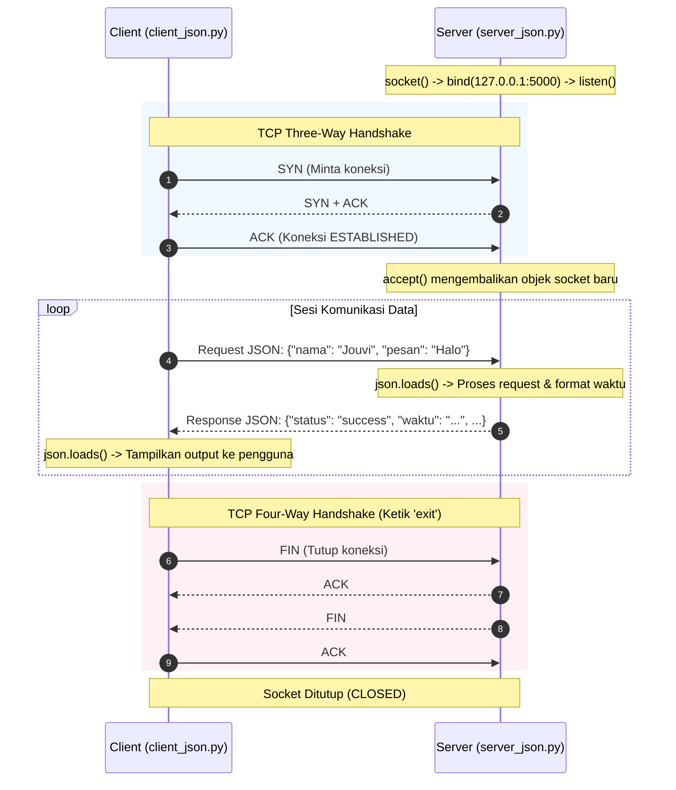

# 🌐 Python TCP Client-Server Socket Programming

[](https://www.python.org/)
[](https://en.wikipedia.org/wiki/Transmission_Control_Protocol)
[](#arsitektur-sistem)
[](LICENSE)

Repositori ini berisi implementasi fundamental pemrograman jaringan (*network programming*) menggunakan **Socket API** berbasis protokol **TCP (Transmission Control Protocol)** pada bahasa pemrograman Python. Proyek ini mencakup dua skenario implementasi: komunikasi teks sederhana (*plain text*) dan pertukaran data terstruktur (*structured payload*) menggunakan **JSON**.

Proyek ini disusun sebagai bagian dari modul **Praktikum Pemrograman Jaringan (Network Programming)**.

---

## 📑 Daftar Isi

- [Fitur Utama](#-fitur-utama)
- [Arsitektur Sistem](#-arsitektur-sistem)
- [Struktur Direktori](#-struktur-direktori)
- [Prasyarat Sistem](#-prasyarat-sistem)
- [Panduan Menjalankan Program](#-panduan-menjalankan-program)
  - [1. Versi Dasar (Plain Text)](#1-versi-dasar-plain-text)
  - [2. Versi JSON (Data Terstruktur)](#2-versi-json-data-terstruktur)
- [Konsep Jaringan yang Diterapkan](#-konsep-jaringan-yang-diterapkan)
- [Troubleshooting & Penanganan Error](#-troubleshooting--penanganan-error)
- [Kontributor](#-kontributor)

---

## 🚀 Fitur Utama

- **Zero External Dependencies**: Dibangun murni menggunakan *Python Standard Library* (`socket`, `json`, `datetime`), tanpa perlu instalasi `pip` tambahan.
- **Dua Model Komunikasi**:
  1. **Versi Dasar (`basic`)**: Pertukaran string mentah dengan balasan timestamp otomatis dari server.
  2. **Versi Lanjutan (`json`)**: Pertukaran payload data multi-atribut terstruktur via serialisasi JSON.
- **Socket Recycling**: Menggunakan opsi `SO_REUSEADDR` untuk mencegah penguncian port saat server di-restart (*TIME_WAIT bypass*).
- **Graceful Shutdown**: Mekanisme penutupan koneksi dua arah secara tertib melalui instruksi `exit` (*Four-Way Handshake*).

---

## 🏗 Arsitektur Sistem

Komunikasi client-server dibangun di atas lapisan transport (Layer 4) dengan protokol **TCP** yang menjamin pengiriman data andal (*reliable*), terurut (*ordered*), dan *connection-oriented*.



---

## 📁 Struktur Direktori

```text
praktikum_1/
├── server_basic.py     # Server TCP dasar (Plain text & timestamp generator)
├── client_basic.py     # Client TCP dasar
├── server_json.py      # Server TCP dengan dukungan serialisasi JSON & SO_REUSEADDR
├── client_json.py      # Client TCP dengan pengiriman payload JSON interaktif
├── kerangka_laporan.md # Laporan komprehensif & analisis teknis praktikum
├── TEST_RESULT.txt     # Log hasil uji coba integrasi modul JSON
├── README.txt          # Catatan petunjuk ringkas asli
└── README.md           # Dokumentasi publik repositori (berkas ini)
```

---

## 💻 Prasyarat Sistem

- **Python**: Versi `3.8` atau yang lebih baru (diuji pada Python 3.12 dan 3.14).
- **Sistem Operasi**: Windows, Linux, atau macOS (kode socket bersifat *cross-platform*).
- **Terminal**: Disarankan menggunakan minimal dua jendela terminal / PowerShell / tab terminal VS Code.

---

## 📖 Panduan Menjalankan Program

Setiap versi membutuhkan **dua jendela terminal**: satu untuk menjalankan server dan satu lagi untuk client.

### 1. Versi Dasar (Plain Text)

#### Langkah 1: Jalankan Server
Buka terminal pertama dan ketik:
```bash
python server_basic.py
```
*Output Terminal Server:*
```text
Server berjalan di 127.0.0.1:5000
Menunggu koneksi client...
```

#### Langkah 2: Jalankan Client
Buka terminal kedua dan ketik:
```bash
python client_basic.py
```
*Output Terminal Client:*
```text
Terhubung ke server 127.0.0.1:5000
Ketik pesan. Ketik 'exit' untuk keluar.
Client: Halo Server
Server: 2026-09-16 10:30:15
Client: exit
Client berhenti.
```

---

### 2. Versi JSON (Data Terstruktur)

> [!IMPORTANT]
> Pastikan server versi dasar telah dimatikan terlebih dahulu (`Ctrl + C` atau ketik `exit`) agar port `5000` tidak bentrok.

#### Langkah 1: Jalankan Server JSON
Buka terminal pertama:
```bash
python server_json.py
```
*Output Terminal Server:*
```text
Server JSON berjalan di 127.0.0.1:5000
Menunggu koneksi client...
```

#### Langkah 2: Jalankan Client JSON
Buka terminal kedua:
```bash
python client_json.py
```

*Interaksi pada Client:*
```text
Terhubung ke server 127.0.0.1:5000
Format: nama dan pesan. Ketik 'exit' pada pesan untuk keluar.
Nama: Jouvi
Pesan: Halo Server
Server: {'status': 'success', 'nama': 'Jouvi', 'pesan': 'Halo Server', 'tanggal': '2026-09-16', 'waktu': '10:32:00'}

Nama: Jouvi
Pesan: exit
Server: {'status': 'success', 'pesan': 'Koneksi ditutup oleh client.'}
Client berhenti.
```

---

## 🧠 Konsep Jaringan yang Diterapkan

| Konsep | Penjelasan pada Program |
|---|---|
| **Socket Endpoint** | Ditentukan oleh pasangan `(IP, Port)` yaitu `('127.0.0.1', 5000)`. |
| **`AF_INET` & `SOCK_STREAM`** | `AF_INET` menggunakan pengalamatan IPv4, sedangkan `SOCK_STREAM` memilih protokol transmisi TCP yang andal dan berurutan. |
| **Blocking Call** | Pemanggilan `accept()` dan `recv()` akan memblokir thread eksekusi hingga data atau permintaan koneksi tiba. |
| **Encoding / Decoding** | Socket hanya dapat mengirimkan aliran biner (*raw bytes*). Karena itu string dikonversi melalui `.encode('utf-8')` sebelum dikirim dan `.decode('utf-8')` setelah diterima. |
| **Data Framing** | TCP memperlakukan data sebagai *byte stream* tanpa batas pesan (*no message boundary*). Penggunaan JSON memudahkan rekonstruksi batas data objek pada sisi penerima. |

---

## 🛠 Troubleshooting & Penanganan Error

### 1. `OSError: [WinError 10048] Only one usage of each socket address is normally permitted`
* **Penyebab:** Port `5000` masih terkunci karena server sebelumnya belum dihentikan atau masih berjalan di background.
* **Solusi di Windows (PowerShell):**
  ```powershell
  # 1. Cari PID proses yang memakai port 5000
  Get-NetTCPConnection -LocalPort 5000 -ErrorAction SilentlyContinue

  # 2. Hentikan proses berdasarkan PID yang ditemukan (misal: 9772)
  Stop-Process -Id <PID> -Force
  ```
* **Solusi di Linux / macOS:**
  ```bash
  lsof -i :5000
  kill -9 <PID>
  ```

### 2. `ConnectionRefusedError: [WinError 10061]`
* **Penyebab:** Client dijalankan sebelum server aktif atau alamat target salah.
* **Solusi:** Pastikan `server_basic.py` atau `server_json.py` sudah berstatus `Menunggu koneksi client...` sebelum menjalankan skrip client.

### 3. `ConnectionResetError: [WinError 10054]`
* **Penyebab:** Client dimatikan secara mendadak (*crash* / jendela terminal langsung ditutup) sehingga sistem operasi mengirimkan paket **TCP RST**.
* **Solusi:** Tutup koneksi secara tertib dengan mengetik perintah `exit`.

---

## 👤 Kontributor

- **Nama:** Nur Akhmad Van Jouvi
- **NIM:** 2314000024
- **Mata Kuliah:** Network Programming
- **Dosen Pengampu:** Dr. Hadi Syahrial, S.Si., M.M., M.Kom.

---
*Dibuat untuk tujuan edukasi dan pemahaman praktis jaringan komputer.*
